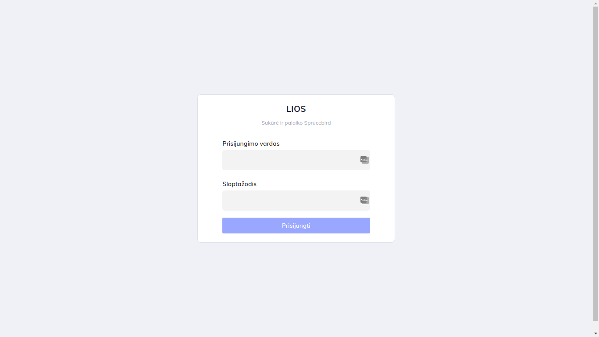
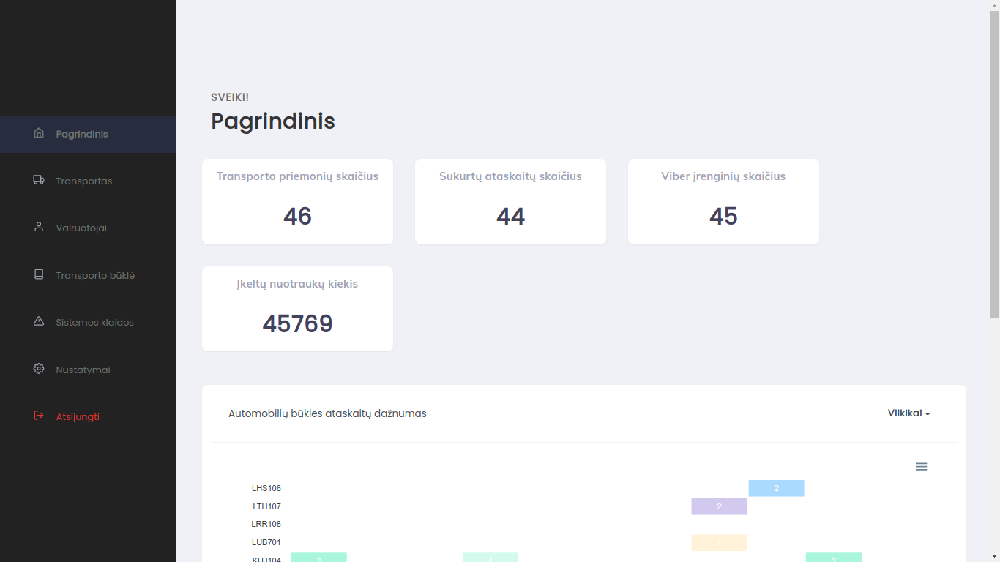
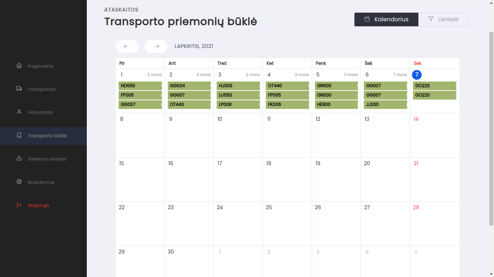
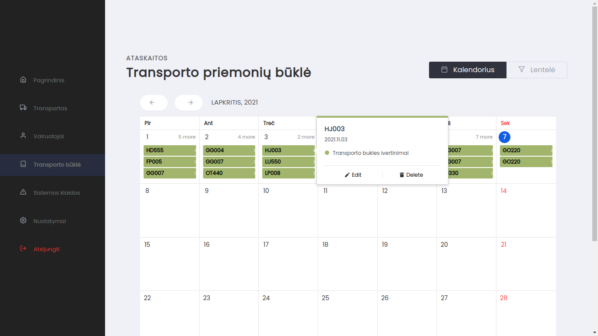
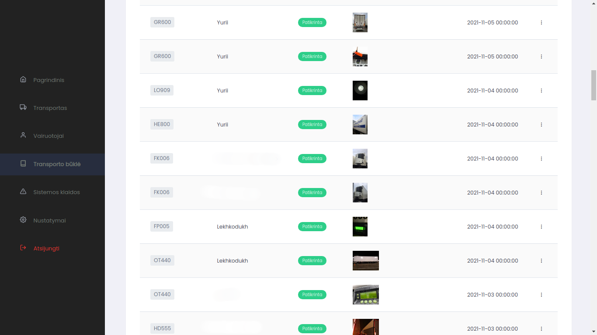

# Showcase

# Mechanisms
## Framework
The framework used is [Laravel](https://laravel.com/)

## Data managment
To manage our data, we used a relational mysql database and deployed everything to a [Digitalocean](https://www.digitalocean.com/) virtual machine. 

## Data transfer
We made a [Viber](https://www.viber.com/en/) chatbot that uses RegExp to recognize user input and transfer photographs of logistical transport. 

## Why we don't share the code
We programmed the system being inexprienced and willing to learn. While learning of course we made some mistakes that might still be lingering somewhere in the code. Usually that would not be a problem, except for that this system is still being used as a convienience tool and due to that we would not like to cause any inconvenience for it's users.
